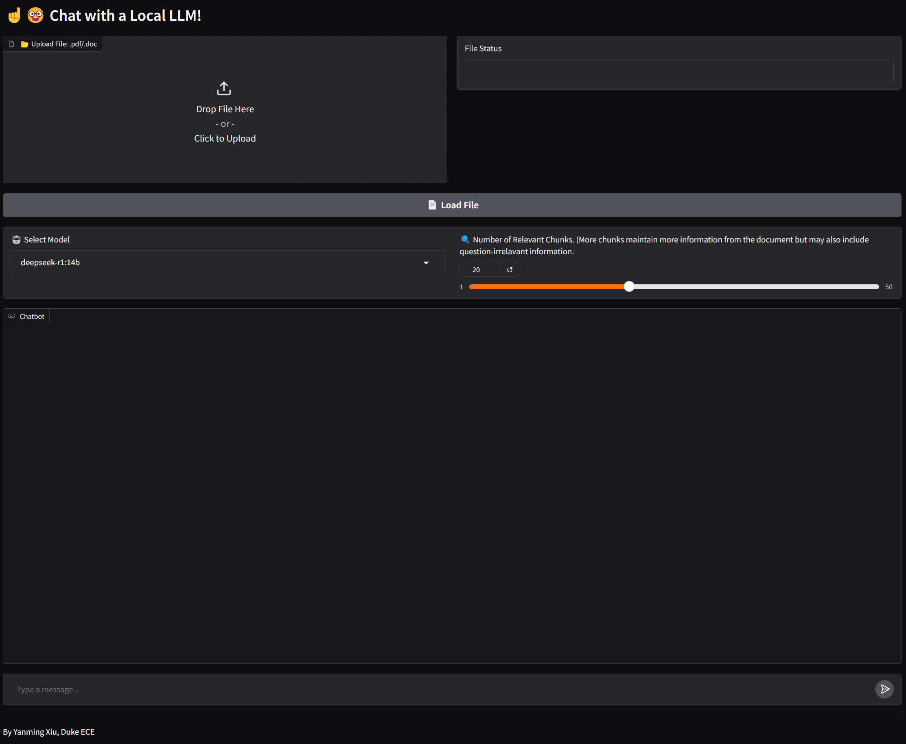

# LocalLLM-PaperReviewer

A Local LLM-Powered Paper Reviewing Assistant

## 📌 Overview

Need to review papers but have limited time? Concerned about maintaining academic integrity when uploading unpublished materials to commercial or open AI platforms? No worries—LocalLLM-PaperReviewer has you covered! LocalLLM-PaperReviewer is a lightweight, privacy-friendly tool that utilizes a local large language model (LLM) to assist with academic paper reviews. It enables researchers to analyze, summarize, and critique papers efficiently without relying on cloud-based AI services.

Note: currently the repo has been only tested on Windows!

## ✨ Features

✅ Runs Locally – No internet required, ensuring data privacy of unpublished scripts;

✅ File Upload Support – Upload research papers in pdf/doc format for context-aware analysis;

✅ Adaptive Reviewing – Customize the number of relevant document chunks for better context;

✅ Multi-Turn Conversations – Keeps track of previous discussions for coherent feedback;

✅ Custom Model Selection – Choose between different LLMs, like deepseek-r1:8b;

⏳ Chat history storage - Allow users to retrieve previous conversations; (in progress)


## 🔧 Setup

Install ollama at [Ollama Official Website](https://ollama.com/);

Open a command prompt, deploy the models you want. For example, with deepseekr1-14b:
```markdown
ollama pull deepseekr1-14b
```


Clone the repo:
```markdown
git clone https://github.com/YM-Xiu/LocalLLM-PaperReviewer.git
```

Create the virtual environment with Anaconda: (assume you already have Anaconda and Pip ready)
```markdown
conda create -n localllm python=3.10
```

Install the dependencies: (for different devices, use the faiss version that suits your device)
```markdown
conda activate localllm
pip install langchain requests gradio fitz frontend pymupdf langchain_ollama langchain_community
conda install -c conda-forge faiss-gpu / conda install -c conda-forge faiss-cpu
```

Before running the code, you may (and may not) need to activate the Ollama service in the command prompt:
```markdown
ollama serve
```

Then, get into the repo folder:
```markdown
cd LocalLLM-PaperReviewer
python localllm.py
```

Then, your default browser should open a window like this.

<p align="center">
  
</p>

Here, you can upload files for LLM to process and ask questions. You can also change the LLM model and the number of relavant chunks.

## 🖊 User Notes

1. You don't have to upload PDF/DOC file first before chatting. In each conversation, you can only upload one PDF/DOC file.
2. By default, the model retains the document content while remembering only the latest five chat exchanges. However, you can customize this behavior in the code.
3. You can also install other models that you like from Ollama. To update the model list, find **AVAILABLE_MODELS** in localllm.py.

## 👤 About the Author

**Yanming Xiu**  

🔹 Ph.D. Student at ECE, Duke University

🔹 Research interest: Augmented Reality, Computer Vision, Scene Understanding.

 
